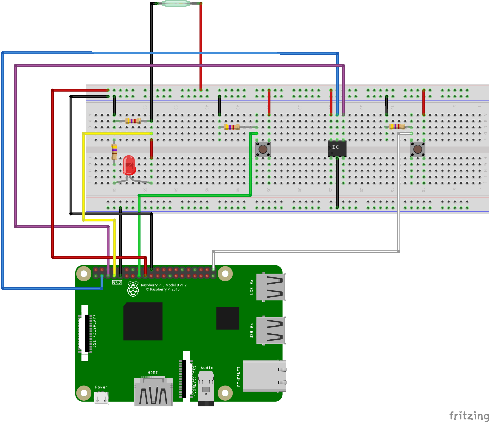

# raingauge
ラズベリーパイを使って転倒ます型雨量計による降水量観測を行うプログラム


## 準備
### 1. 雨量計本体の作成
以下を参考に作成させていただきました。
https://www.youtube.com/watch?v=_lMptjhhKrI

### 2. ラズパイへの接続
以下図のように配線を行う



### 3. 環境構築
python=3.8


## 使い方

### 1. 観測
観測データはsqlite3を用いて `data/weather.db`に蓄積していく
観測を開始するときは
```bash
$ python raingauge_observer.py
```

またserviceとしてバックグランドで起動させる場合は
1. `run_obs.sh`の`$RUN_PYTHON`を自身の環境のpythonパスに変更
2. `etc/raingauge_obs.service`の`ExecSart`を`run_obs.sh`のファイルパスに変更
3. 2.のファイルを`~/.config/systemd/user/`以下に配置
4. `$ systemctl --user enable raingauge_obs`でserviceを有効化
5. `$ systemctl --user start raingauge_obs`でserviceを起動

サービスをラズパイ起動時に実行させる場合は追加で以下のコマンドを実行することで、実行ユーザーがログインしなくてもサービスが起動する
```bash
$ sudo loginctl enable-linger <username> 
```


### 2. データ可視化(工事中)
dashboard.pyを実行して、これをtailscaleを使ってVPNで公開することで所有する任意の端末から観測値を閲覧できるようにできる。
これについては後で書く

## Authors
Takato Onishi

## References
